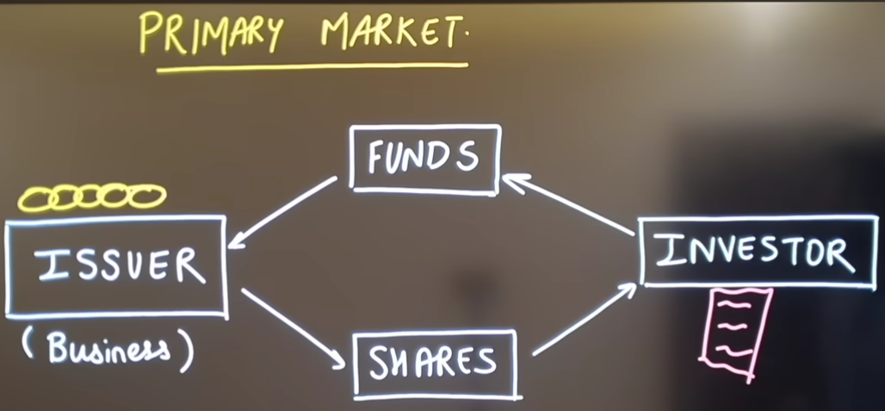

# Primary Market
- Also known as New Issue Market.
- It is controlled by SEBI.
- In here, various brokers such as Upstox etc. help us in trading activities.
- It is a place where companies create share and sells them to public for the very first time.
- In this market, the transaction happens directly between the issuer (the company or government raising money) and the buyer.
- Because the securities are fresh, the cash generated from the sale goes directly into the company's bank account to fund expansions, research etc.
- 
## Protection against Defaults
- In the primary market, the biggest risk isn't that a company's stock price will drop tomorrow—it's the risk of getting cheated. For example, a fake company could promise to build a massive tech empire, take your money during their IPO, and disappear into thin air.
- So to prevent this, SEBI act as a guard before any company is allowed to enter primary market.

## Types of Issues in Primary Market
- Issues essentially refers to creating and offering new financial assets to the public.  
1) Public Issue
   - It is a process where a company invites the general public to buy its brand-new shares or bonds for the very first time.
   - It is of further 2 types: IPO and FPO
        - IPO(Initial Public Offer),
          - It is the very first time a private company decides to sell its shares to the general public.
        - FPO(Follow-on Public Offer) 
          - It happens when a company that is already public and listed on the stock exchange decides to issue a fresh batch of new shares to the public to raise even more money.
          - FPO is on primary market, bcos it's creating brand new shares.

2) Private Issue
   - Instead of opening the gates to the general public through a massive billboard event like an IPO, the company invites a small, select group of wealthy individuals or institutional investors to buy their shares or bonds behind closed doors.
  

# Secondary Market
- After people buy shares from companies in primary market, they exchanges the shares between themselves in 2ndary market. So, The primary market introduces the shares to the world, and the secondary market keeps them moving.
- It is the marketplace where regular investors buy and sell shares with each other, long after the company originally created them.
- eg: BSE/NSE
- Listing on an exchange
    - It simply means the company has officially been added to the master menu of a major stock market (like the NSE, BSE, or NYSE) so that the public can start trading its shares in the secondary market.  