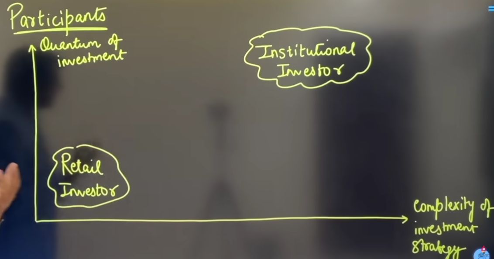

# Stock/Share
- It represents the fractional ownerships in a company.
- Eg: When you buy a share of stock, you are purchasing a tiny piece of that corporation. For example, if a company has 1,000 total shares outstanding, and you buy 10 shares, you own 1% of the company.
- 
  
# Stock Market
- The stock market is a public, digital marketplace where everyday investors and large institutions come together to buy, sell, and trade shares of publicly owned companies.
- The act of buying and selling stocks is called Trading
- It can be done in both Primary and Secondary market.

## Participants in a Stock Market
- 
-  # Retail Investor
     - A retail investor is an individual, non-professional investor who buys and sells securities (like stocks, bonds, or mutual funds) for their own personal accounts.
     - As indicated in graph above, their magnitude and complexity is often low
     - They are mostly common people or individuals
-  # Institutional Investors
     - An institutional investor is a professional organization or company that pools together large sums of money from many different people to invest it on their behalf.
     - Unlike Retail investors, their magnitude and complexity is much bigger and complex
     - They often invest in 1000s of cr of money.
     - Examples of such institutes are: Banks, Insurance companies, Hedge Funds, Mutual Funds etc.

# How do such Institutional institutes gather so much money?
- In such organizations, there are position/people called Fund Manager which are analysts, traders etc.
- Suppose they get 5K cr from different groups are individuals, what they do with that money is that, they invest such money in various places, stocks, shares etc. 
- There is always a risk, but it is comparatively low as these guys "diversify" the investment so much, so chances of loss are low