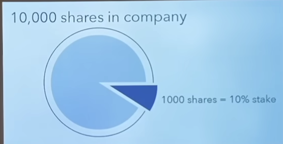

# Stock/Share
- It represents the fractional ownerships in a company.
- Eg: When you buy a share of stock, you are purchasing a tiny piece of that corporation. For example, if a company has 1,000 total shares outstanding, and you buy 10 shares, you own 1% of the company.
- 
  
# Stock Market
- The stock market is a public, digital marketplace where everyday investors and large institutions come together to buy, sell, and trade shares of publicly owned companies.
- The act of buying and selling stocks is called Trading
- It can be done in both Primary and Secondary market.